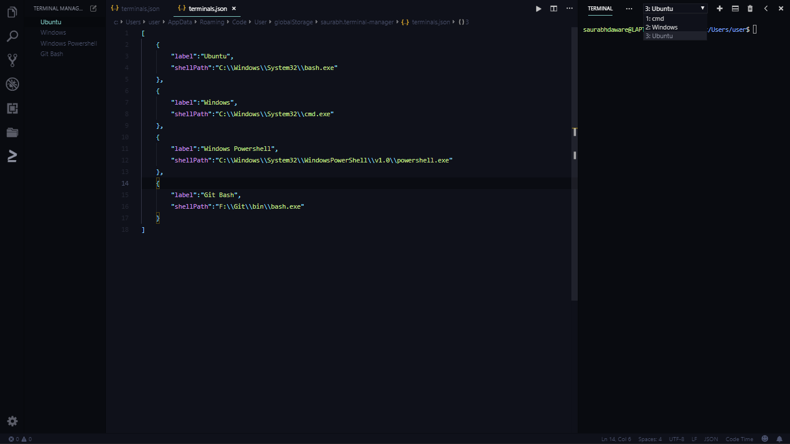
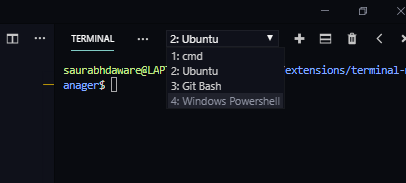

#  Terminal Manager

Terminal Manager is a visual studio code extension to switch between various terminals.

[](https://marketplace.visualstudio.com/items?itemName=saurabh.terminal-manager) [](https://marketplace.visualstudio.com/items?itemName=saurabh.terminal-manager) [](https://marketplace.visualstudio.com/items?itemName=saurabh.terminal-manager)

<a href="https://marketplace.visualstudio.com/items?itemName=saurabh.terminal-manager" style="color:#ddd;font-size:10pt;background:#333;padding:10px 14px;border:1px solid #000;">Visit Marketplace</a>

## Features

By default vscode lets us define only one link of terminal from settings.

Using this extension you can provide an array of terminals and then you can switch between them from a new Terminal icon in activity bar.




## Extension Settings

Click the edit icon  in Terminal Manager activity bar to edit the terminal settings.

Here's what sample terminals.json looks like.

```json
[
    {
        "label":"Windows",
        "shellPath":"C://Windows//System32//cmd.exe"
    },
    {
        "label":"Ubuntu",
        "shellPath":"C://Windows//System32//bash.exe"
    },
    {
        "label":"Cygwin",
        "shellPath":"C://Tools//cygwin64//bin//bash.exe",
        "shellArgs":[
            "/bin/xhere",
            "/bin/bash"
        ]
    }
]
```

## Contribution

- Check for the issues on https://github.com/saurabhdaware/vscode-terminal-manager/issues
- Fork the project
- Finish your changes and make Pull Request to Master branch of https://github.com/saurabhdaware/vscode-terminal-manager

## Local Development

- Fork this project
- `git clone https://github.com/{your username}/vscode-terminal-manager`
- `cd vscode-terminal-manager`
- `npm install`
- Open the project in Visual Studio Code and press `Ctrl + f5` to start Extension host.

## Release Notes

### 1.0.0 - 1.0.4

Initial Release of Terminal Manager and Minor Updates.

### 1.0.5

Fixed Path error that was thrown in Ubuntu when edit button was clicked

### TBD - at least 1.0.6

shell args can be added to shell command

----

***Dont forget to star my github repository https://github.com/saurabhdaware/vscode-terminal-manager***

***Enjoy 🎉***
